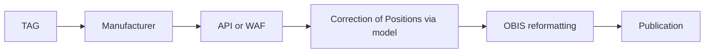
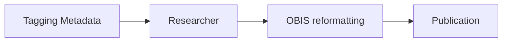
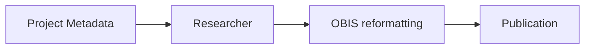

# rt-sat-to-obis
A pilot for delivering real-time satellite telemetry data to OBIS from a few of the popular manufacturers' data portals, through QC to improve upon their position

## Background and data sources
Currently, data are shared from satellite tags to researchers via a WAF or API hosted by the manufacturer. The researcher who applies a satellite tag to an animal knows the species and some number of measurements or facts about the individual animal. The satellite tag carries some number of instruments that measure a set of abiotic variables about the ongoing conditions near the instrument. The researcher has a rationale or reason for applying the tag, a question to answer or a campaign of monitoring that the tag contributes to.

By capturing all of these information, we can generate an archive that is fit to be published to the Ocean Biodiversity Information System in near-realtime. By applying a summarization strategy that is in use for acoustic and satellite tags registered to the Ocean Tracking Network, we can ensure that we do not create too many data points for any one tagged individual, and by harvesting metadata meant to improve discovery of the full-resolution data, we can ensure provenance and attribution are satisfactory to all parties involved in the monitoring effort.

These workflows are very much concerned with the reorganization of existing data into appropriate DarwinCore fields, and once finalized, should be able to be run using minimal hardware.

Due to lags in reporting between tag and manufacturer, manufacturer and researcher, and the time it takes to run a correction model against the individual tracks, the aim is to achieve near-realtime on the order of 6-24 hours, though efforts can be put towards lowering this lag period.

The process then should look like this.

